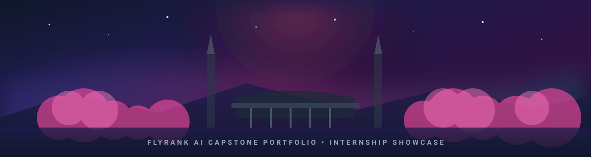
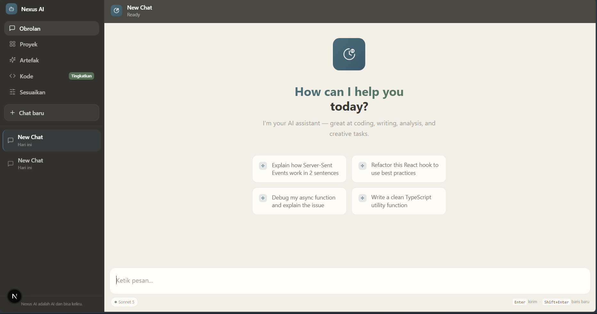
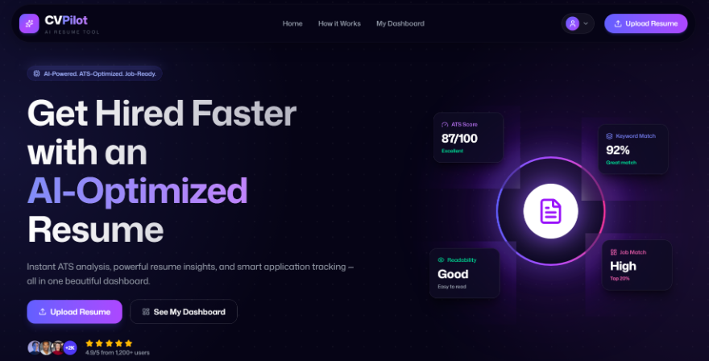
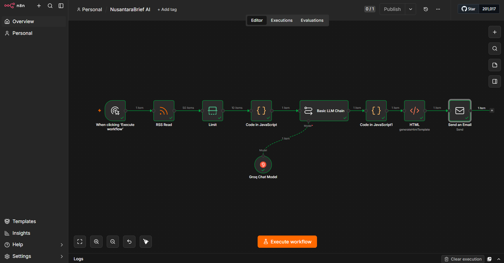
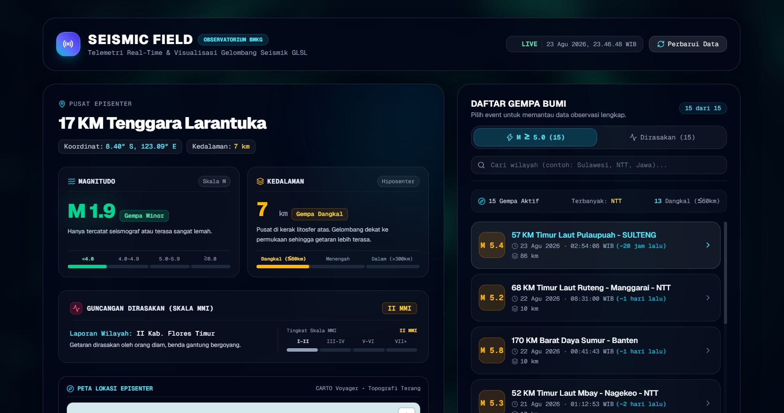
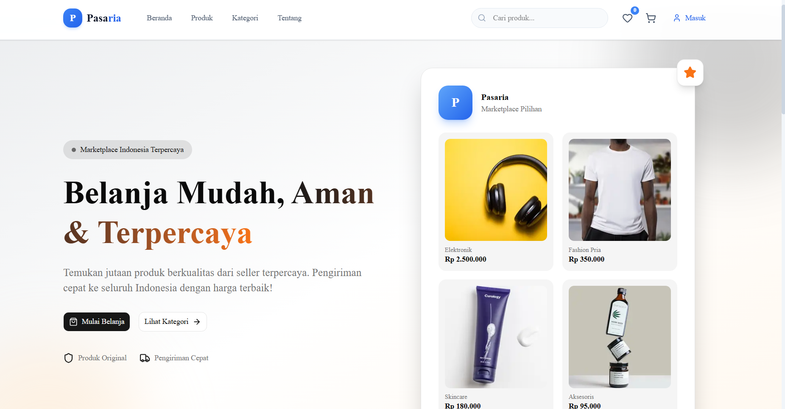
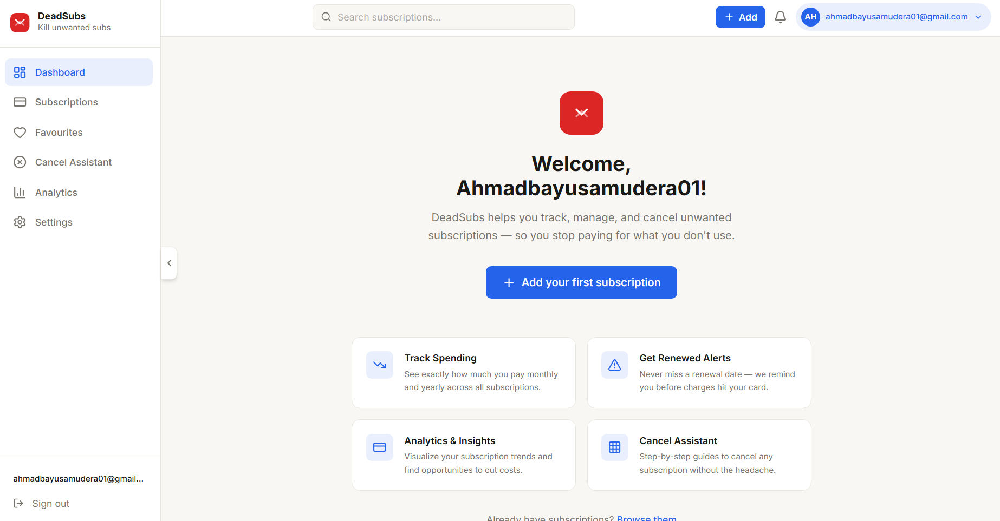
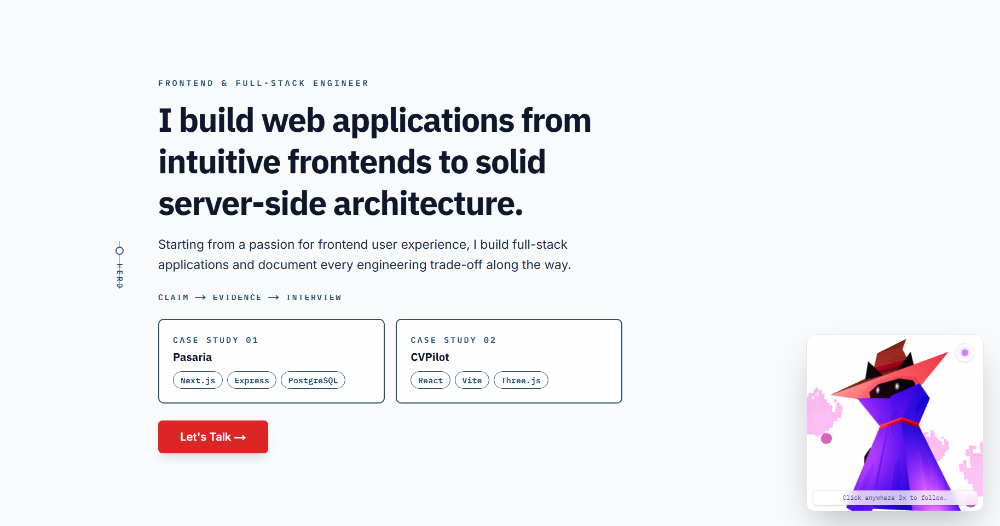
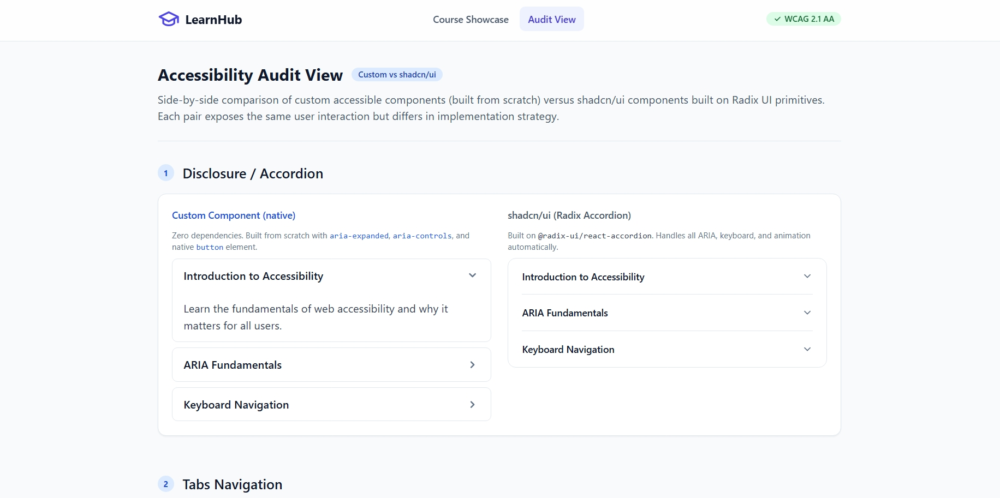
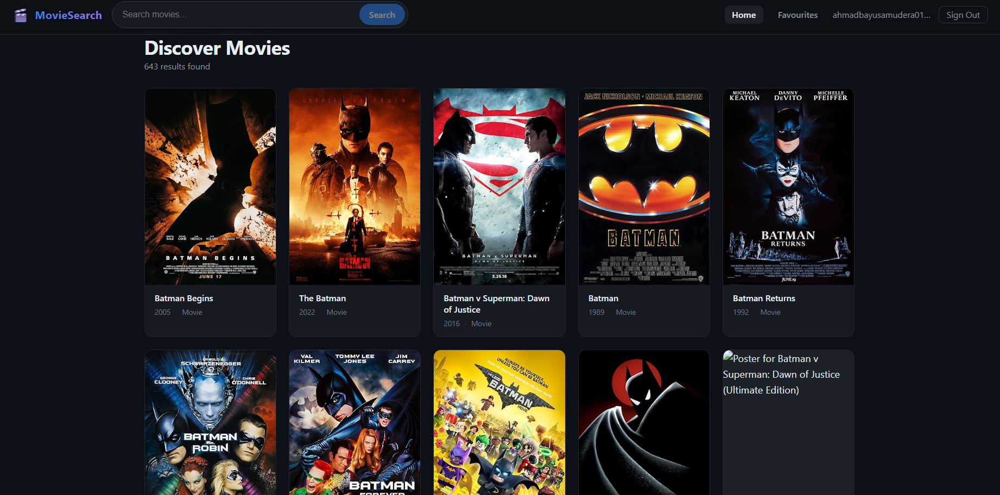

<div align="center">



<br />

# 🎓 FlyRank AI Capstone — Internship Showcase
**Curated Portfolio of Production-Grade AI Agents, Real-Time Observatories & Full-Stack Architecture**

[](https://github.com/AhmadBayu1412)
[](https://www.linkedin.com/in/ahmad-bayu-samudera-985880236/)
[](https://www.dicoding.com/users/ahmadbayusamudera)
[](https://github.com/AhmadBayu1412)
[](https://github.com/AhmadBayu1412)
[](https://github.com/AhmadBayu1412)

</div>

---

> [!NOTE]
> 💡 **Developer Philosophy & Internship Workspace**  
> _"Learning every day, building meaningful digital experiences. Progress, not perfection."_  
> Repositori ini mengintegrasikan seluruh portofolio dan proyek unggulan **FlyRank AI Capstone** serta perjalanan rekayasa perangkat lunak oleh **Ahmad Bayu Samudera**. Setiap proyek dibangun dengan standar industri: arsitektur yang modular, optimasi latensi, integrasi AI/Agentic workflows, kepatuhan aksesibilitas W3C ARIA, serta *Architecture Decision Records* (ADR).  
> *Buka `index.html` di browser Anda untuk menjelajahi interactive Notion-style Workspace viewer.*

---

## 📑 Table of Contents

- [🚀 Interactive Notion Workspace](#-interactive-notion-workspace)
- [🤖 Agentic AI & Intelligence Systems](#-agentic-ai--intelligence-systems)
- [🌐 Real-Time Telemetry & Full-Stack Platforms](#-real-time-telemetry--full-stack-platforms)
- [🎨 System Architecture, Accessibility & Media](#-system-architecture-accessibility--media)
- [💻 Tech Stack & Architecture Matrix](#-tech-stack--architecture-matrix)
- [🧭 Capstone Retrospective (FL-10)](#-capstone-retrospective-fl-10)
- [🛠️ Local Workspace Setup](#️-local-workspace-setup)

---

## 🚀 Interactive Notion Workspace

Repositori ini dilengkapi dengan antarmuka web interaktif bergaya **Notion Workspace** (`index.html`) yang memungkinkan Anda untuk:
- 📖 Membaca seluruh dokumen **README.md** masing-masing proyek langsung dari sidebar tanpa meninggalkan halaman.
- 🔍 Melakukan pencarian instan (*instant search & keyword filter*) berdasarkan kategori, tech stack, dan fitur.
- 🌓 Beralih antara mode **Notion Dark** dan **Notion Light**.
- 📋 Menyalin tautan dan membuka live deployment / repositori GitHub secara langsung.

---

## 🤖 Agentic AI & Intelligence Systems

<table>
<tr>
<td width="50%" valign="top">

<a href="https://github.com/AhmadBayu1412/nexus-ai">


### 🤖 Nexus AI — Enterprise Streaming Chatbot & Agentic Platform
</a>

Traditional AI chatbots often suffer from brittle streaming lifecycles, slow time-to-first-token, sidebar clutter from empty abandoned chats, lack of enterprise context or real-time web verification, vulnerable API endpoints susceptible to token-draining abuse, and poor accessibility for keyboard and screen-reader users.

- **Highlights**: Ultra-low TTFT SSE streaming, Rate limit & abuse shield, Contextual real-time web verification, ARIA screen-reader verified.
- **Tech Stack**: `Next.js` `TypeScript` `Agentic Workflows` `Vercel AI SDK` `TailwindCSS`
- **Documentation**: [`docs/readmes/nexus-ai.md`](docs/readmes/nexus-ai.md)

[](https://nexus-ai-chatbot-opal.vercel.app/)
[](https://github.com/AhmadBayu1412/nexus-ai)

</td>
<td width="50%" valign="top">

<a href="https://github.com/AhmadBayu1412/ai-resume-analyzer">


### 📄 CVPilot — AI-Powered Resume Analyzer & ATS Optimization
</a>

CVPilot is a modern AI-powered resume analyzer platform designed to help job seekers improve their resumes, optimize ATS compatibility, and receive intelligent feedback for better hiring opportunities. The platform combines elegant UI design with AI-driven resume analysis to create a fast, interactive, and beginner-friendly career optimization experience.

- **Highlights**: Deep ATS score breakdown, Keyword match analysis, AI section rewrite recommendations, interactive radial score dashboard.
- **Tech Stack**: `React` `TypeScript` `Three.js` `Vite` `Gemini API`
- **Documentation**: [`docs/readmes/cvpilot.md`](docs/readmes/cvpilot.md)

[](https://cv-ai-resume-analyzer.netlify.app/)
[](https://github.com/AhmadBayu1412/ai-resume-analyzer)

</td>
</tr>
<tr>
<td colspan="2" valign="top">

<a href="https://github.com/AhmadBayu1412/flyrank-ai-capstone">


### 📰 NusantaraBrief AI — Intelligent News Curation Agent
</a>

NusantaraBrief AI is an **n8n**-based intelligent news curation agent designed to analyze national news feeds comprehensively and efficiently. It fetches multi-source RSS streams, deduplicates headlines, leverages Groq/LLM chains for multi-lingual synthesis, generates responsive HTML briefings, and dispatches automated executive summaries via email.

- **Highlights**: Automated n8n workflow pipeline, Groq LLM fast inference, RSS multi-feed aggregation, automated email digest dispatcher.
- **Tech Stack**: `n8n` `Groq LLM` `JavaScript Node Engine` `RSS Feed Parser` `HTML Email Templates`
- **Documentation**: [`docs/readmes/nusantarabrief.md`](docs/readmes/nusantarabrief.md)

[](docs/readmes/nusantarabrief.md)
[](https://github.com/AhmadBayu1412/flyrank-ai-capstone)

</td>
</tr>
</table>

---

## 🌐 Real-Time Telemetry & Full-Stack Platforms

<table>
<tr>
<td width="50%" valign="top">

<a href="https://github.com/AhmadBayu1412/seismic-field">


### 🌐 SEISMIC FIELD — Real-Time Earthquake Observatory
</a>

A state-of-the-art, real-time earthquake observatory visualizing official event telemetry from BMKG (Badan Meteorologi, Klimatologi, dan Geofisika), integrated with an interactive MapLibre GL Locator Map, an Interactive GLSL Seismic Fragment Shader, and a dynamic Earth Crust Hypocenter Depth Visualizer.

- **Highlights**: BMKG live telemetry feed, Custom GLSL seismic wave fragment shaders, MapLibre GL geospatial locator, Hypocenter depth cross-section.
- **Tech Stack**: `Next.js` `MapLibre GL` `GLSL Shaders` `WebGPU/WebGL` `TailwindCSS`
- **Documentation**: [`docs/readmes/seismic-field.md`](docs/readmes/seismic-field.md)

[](https://seismic-field.vercel.app/)
[](https://github.com/AhmadBayu1412/seismic-field)

</td>
<td width="50%" valign="top">

<a href="https://github.com/AhmadBayu1412/Pasaria-E-Commerce">


### 🛒 Pasaria E-Commerce — Modular Monolith Platform
</a>

A Modern Full-Stack E-Commerce Platform built with a Modular Monolith Architecture, Real-Time Inventory Reservation, and a Full Order Lifecycle State Machine. Solves overselling via distributed concurrency controls and optimistic locking.

- **Highlights**: Modular monolith domain boundaries, Redis inventory locks, Strict order lifecycle state machine, Seamless cart & checkout flow.
- **Tech Stack**: `Next.js` `Express.js` `PostgreSQL` `Prisma` `Redis`
- **Documentation**: [`docs/readmes/pasaria.md`](docs/readmes/pasaria.md)

[](https://pasaria-e-commerce.vercel.app/)
[](https://github.com/AhmadBayu1412/Pasaria-E-Commerce)

</td>
</tr>
<tr>
<td colspan="2" valign="top">

<a href="https://github.com/AhmadBayu1412/deadsubs">


### 💳 DeadSubs — Subscription Cancellation & Financial Wellness
</a>

A focused financial wellness tool that helps users eliminate unwanted subscription auto-renewals, understand their monthly burn rate, and execute quick cancellations with automated cancellation playbooks and renewal reminder notifications.

- **Highlights**: Monthly burn rate calculator, One-click cancellation assistant guides, Upcoming renewal alerts, Privacy-first client persistence.
- **Tech Stack**: `React` `TypeScript` `TailwindCSS` `Zustand` `Netlify`
- **Documentation**: [`docs/readmes/deadsubs.md`](docs/readmes/deadsubs.md)

[](https://deadsubs.netlify.app/)
[](https://github.com/AhmadBayu1412/deadsubs)

</td>
</tr>
</table>

---

## 🎨 System Architecture, Accessibility & Media

<table>
<tr>
<td width="50%" valign="top">

<a href="https://github.com/AhmadBayu1412/portfolio">


### 🏛 Portfolio — Case Study & ADR-Driven Engineering
</a>

A portfolio website that shows the *why*, not just the *what* — built around detailed case studies and Architecture Decision Records (ADRs) instead of generic project listings. Documents engineering trade-offs, benchmarks, and architectural decisions.

- **Highlights**: Architecture Decision Records (ADRs), Interactive 3D mascot avatar, In-depth engineering case studies, Claim-to-Evidence verification.
- **Tech Stack**: `Next.js` `Three.js` `TypeScript` `Framer Motion` `TailwindCSS`
- **Documentation**: [`docs/readmes/portfolio-adr.md`](docs/readmes/portfolio-adr.md)

[](https://ahmad-bayu-samudera.netlify.app/)
[](https://github.com/AhmadBayu1412/portfolio)

</td>
<td width="50%" valign="top">

<a href="https://github.com/AhmadBayu1412/LearnHub">


### ♿ LearnHub — Frontend AI & Accessibility Masterclass
</a>

A mini LMS showcase built with React + TypeScript, demonstrating W3C ARIA APG compliance through hand-crafted accessible components alongside a shadcn/ui + Radix UI comparison layer for deep architectural evaluation.

- **Highlights**: WCAG 2.1 AA Compliance, Side-by-side audit view (Native ARIA vs Radix UI), Keyboard trap testing & focus management.
- **Tech Stack**: `React` `TypeScript` `Radix UI` `shadcn/ui` `TailwindCSS`
- **Documentation**: [`docs/readmes/learnhub.md`](docs/readmes/learnhub.md)

[](https://github.com/AhmadBayu1412/LearnHub)

</td>
</tr>
<tr>
<td colspan="2" valign="top">

<a href="https://github.com/AhmadBayu1412/MovieMate">


### 🎬 MovieSearch / MovieMate — Movie Discovery App
</a>

A movie discovery app built with React, TypeScript, and Firebase. Search OMDb for movies, view ratings, synopsis details, and save your favourites with real-time Firebase syncing.

- **Highlights**: OMDb API query caching, Firebase user favourites synchronization, Responsive poster gallery with instant search debounce.
- **Tech Stack**: `React` `TypeScript` `Firebase Auth & Firestore` `OMDb API`
- **Documentation**: [`docs/readmes/moviesearch.md`](docs/readmes/moviesearch.md)

[](https://github.com/AhmadBayu1412/MovieMate)

</td>
</tr>
</table>

---

## 💻 Tech Stack & Architecture Matrix

| Project | Category | Frontend / UI | Backend / Infra | Key Architecture Feature |
| :--- | :--- | :--- | :--- | :--- |
| **Nexus AI** | AI & Agents | Next.js 16, React 19, Tailwind v4 | Vercel AI SDK, Prisma, Neon Postgres | SSE Streaming, Rate Shield, Tool Calling |
| **CVPilot** | AI & Agents | React 19, Vite, Three.js | Gemini API, WebGL | ATS Keyword Gap Scorer, Radial Metrics |
| **NusantaraBrief AI** | AI & Agents | HTML Email Digest Templates | n8n, Groq LLM, Antara RSS | Autonomous Workflow, Multi-Feed Parser |
| **SEISMIC FIELD** | Real-Time Telemetry | MapLibre GL, GLSL Shaders | BMKG API, WebGL / WebGPU | GPU Wave Propagation, Hypocenter Cross-Section |
| **Pasaria E-Commerce** | Full-Stack | Next.js, TailwindCSS | Express.js, PostgreSQL, Redis | Modular Monolith, Inventory Locking, State Machine |
| **DeadSubs** | Full-Stack & FinTech | React, TailwindCSS, Zustand | IndexedDB (Dexie), Firebase Auth | Burn Rate Projections, Cancellation Playbooks |
| **ADR Portfolio** | UI/UX & Architecture | Next.js, Three.js, Framer Motion | Playwright, Lighthouse CI | ADR Documentation, 3D Interactive Mascot |
| **LearnHub** | UI/UX & Accessibility | React, Radix UI, shadcn/ui | TypeScript Strict | WCAG 2.1 AA APG, Side-by-side Component Audit |
| **MovieMate** | Full-Stack & Media | React 19, Plain CSS Variables | Firebase Auth & Firestore, OMDb API | Debounced Search, Real-Time Cloud Sync |

---

## 🧭 Capstone Retrospective (FL-10)

> *"Learning AI Fluency does not guarantee you an immediate job, nor does it guarantee you will understand how to build an application from scratch to mastery instantly. AI Fluency teaches you that work must be done iteratively, and that you need to create a design/ADR before building a real-world application. Don't expect an application to be built with just one 'magic prompt'."*  
> — **Ahmad Bayu Samudera** *(Message to My Week 1 Self)*

Selama 8 minggu sprint intensif (**196 jam kerja tercatat**), perjalanan capstone ini mentransformasi pola pikir rekayasa perangkat lunak: dari seorang *casual prompter* menjadi seorang **AI Systems Builder** yang mengutamakan arsitektur, resilience, dan dampak nyata.

### 🌟 3 Transferable Skills Utama:
1. **Architecture Design & Context Engineering (ADR & Specs):** Persiapan matang dengan dokumen ADR, spesifikasi teknis, dan *Agent Guidelines* membatasi AI agar fokus pada berkas relevan dan mencegah deviasi logika.
2. **Accessibility & Human-Centered Experience (Mobile Testing & Crit):** AI hanya tahu kode berjalan tanpa error, namun tidak bisa merasakan estetika UI/UX. Desain wajib diuji dan dihaluskan dari sudut pandang pengguna manusia nyata.
3. **System Guardrails & Data Sanitization:** Membangun test pipeline, verifikasi rate limiting, error handling, dan refaktorisasi ketat untuk menjamin output sistem bersih, aman, dan dapat dipertanggungjawabkan.

> 📖 **Baca Dokumen Retrospektif Lengkap:** [`RETROSPECTIVE.md`](./RETROSPECTIVE.md)

---

## 🛠️ Local Workspace Setup

Untuk membuka dan menjalankan antarmuka portfolio interaktif secara lokal:

```bash
# 1. Buka repositori di terminal
cd flyrank-ai-capstone

# 2. Buka langsung file index.html di browser favorit Anda, atau jalankan local server
# Menggunakan Python:
python -m http.server 3000

# Atau menggunakan Node (npx serve / live-server):
npx serve .
```

Akses `http://localhost:3000` untuk menikmati interactive Notion experience!

---

<div align="center">
  <sub>Developed with 💡 passion and engineering rigor during the <b>FlyRank AI Internship</b> by <b>Ahmad Bayu Samudera</b></sub>
</div>
